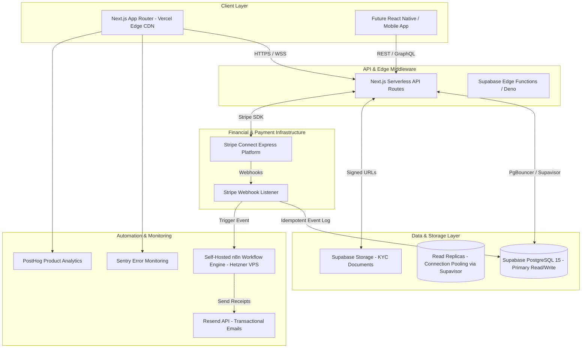

# System Architecture & 100,000+ User Scaling Blueprint

## 1. System Architecture Diagram

---

## 2. Scalability Architecture for 100,000+ Active Users

To scale from MVP to over 100,000 active freelancers without structural refactoring, the following architectural paradigms are enforced:

### 2.1 Database Scaling & Partitioning
- **Connection Pooling**: Utilize **Supavisor** (Supabase's tenant-aware connection pooler) to handle up to 50,000 concurrent database client connections.
- **Table Partitioning**:
  - `invoices` and `transactions` tables are range-partitioned by `created_at` (monthly partitions) to maintain query latency under 15ms even with 50M+ row counts.
- **Read Replicas**: Separate read-heavy dashboard traffic to read replicas while routing financial mutations directly to the primary database node.

### 2.2 Serverless Edge Caching
- **Vercel Edge Network**: Static invoice assets and public checkout views (`/pay/[token]`) are cached globally on Vercel's CDN with Stale-While-Revalidate (SWR) revalidation.
- **Redis Caching Layer**: Upstash Redis integration for user session tokens, rate-limiting counters, and real-time exchange rates.

### 2.3 Webhook Idempotency & Queueing
- Incoming Stripe webhooks are immediately written to the `webhook_events` table and acknowledged with a `200 OK` response within 200ms to prevent Stripe retries.
- Background worker queues (via n8n or BullMQ on Hetzner VPS) asynchronously process notifications, email delivery, and transaction ledger updates.
